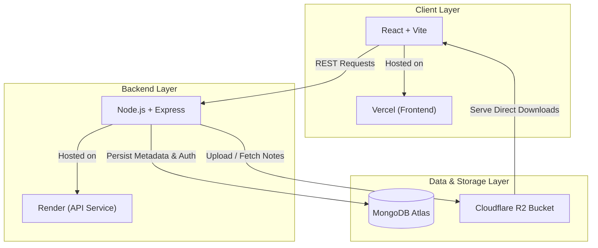

# 📚 NoteSphere

### Smarter notes. Better study experience.

[](https://www.noteshapre.in)
[](https://github.com/satyamkr-05/noteSphere)
[](https://react.dev/)
[](https://nodejs.org/)
[](https://www.mongodb.com/)
[](https://expressjs.com/)

> **NoteSphere** is a full-stack academic resource platform designed to make college notes and previous-year question papers easier to discover, preview and download from one organized place.

Instead of searching through WhatsApp groups, Telegram, Google Drive and random folders, students can use one platform to find the academic resources they need.

**Search → Find → Preview → Download → Learn.**

---

## 🌐 Live Demo

🚀 **Website:**  
https://www.noteshapre.in

💻 **GitHub Repository:**  
https://github.com/satyamkr-05/noteSphere

---

## ✨ Why NoteSphere?

Students often spend a lot of time searching for:

- 📚 College notes
- 📝 Previous-year question papers
- 📖 Subject-wise study material
- 🎓 Course-specific resources
- 📑 Unit/topic-wise notes

These resources are often scattered across different platforms.

**NoteSphere brings academic resources into one structured platform.**

---

# 🚀 Features

## 📚 Notes Library

Students can discover and access organized academic notes.

### Features

- 🔎 Search notes
- 🎯 Advanced filtering
- 📖 Preview notes
- ⬇️ Download notes
- 📊 Download tracking
- ⭐ Featured resources
- 🔥 Trending resources
- 🏫 Course-based organization
- 🌳 Branch-based organization
- 📘 Specialization-based organization
- 📚 Subject-based organization
- 📑 Unit-based organization
- 🏷️ Topic-based organization
- 📝 Resource descriptions
- 🔐 Protected file access
- ♻️ Duplicate-file detection

---

# 📝 Question Bank

NoteSphere also provides a dedicated Question Bank section for previous-year and university examination papers.

### Features

- 🔎 Search question papers
- 🏫 University-based filtering
- 🎓 Course filtering
- 📅 Semester filtering
- 📚 Subject filtering
- 📝 Exam-type filtering
- 📆 Exam-year filtering
- 👁️ Preview papers
- ⬇️ Download papers
- 🔥 Trending question papers
- 📊 Download tracking
- 📄 Pagination

### Supported Exam Types

- Mid Sem
- End Sem
- Sessional
- Practical
- Other

---

# 👥 Role-Based Access Control

NoteSphere uses **Role-Based Access Control (RBAC)** to control what different users can do.

There are three primary roles:

### 👤 User

Normal students can:

- Browse resources
- Search notes
- Search question papers
- Filter resources
- Preview resources
- Download resources
- View download activity
- Manage their profile
- Submit feedback

> Regular users **cannot upload or manage academic resources**.

---

### 🛡️ Sub-Admin

Sub-Admins can:

- Upload notes
- Upload question papers
- Edit academic resources
- Delete academic resources
- Manage uploaded content
- Preview resources
- Manage feedback

---

### 👑 Main Admin

The Main Admin has full administrative control.

Main Admin can:

- Manage users
- Create/manage Sub-Admins
- Promote users
- Demote Sub-Admins
- Remove Sub-Admins
- Manage notes
- Manage question papers
- Edit resources
- Delete resources
- Manage feedback
- View platform statistics
- Monitor platform activity

---

## 🔐 Authentication & Security

Security is an important part of NoteSphere.

### Authentication

- JWT-based authentication
- Password hashing using bcrypt
- Protected routes
- Role-based authorization
- Password reset functionality
- Forgot-password flow
- Token expiration
- Password-change session invalidation
- Reserved administrator account protection

### API Security

- Protected admin APIs
- Protected user APIs
- Authorization middleware
- Backend permission enforcement
- Protected file access
- Input validation
- File validation
- Duplicate-file detection
- Security-related HTTP headers
- Disabled `x-powered-by` header

> Authorization is enforced at the backend/API level, not just by hiding frontend buttons.

---

# 📂 File Management

NoteSphere supports multiple file types for academic resources.

### Supported File Types

- `.pdf`
- `.doc`
- `.docx`
- `.txt`
- `.ppt`
- `.pptx`
- `.jpg`
- `.png`

### Maximum File Size

**10 MB per file**

### File Protection

Files are not simply exposed as public static resources.

Protected endpoints verify authentication and authorization before allowing access to protected academic files.

---

# ♻️ Duplicate File Detection

NoteSphere uses file hashing to detect duplicate uploads.

Before storing a resource, the system can calculate a file hash and compare it with existing files.

This helps prevent:

- Duplicate notes
- Duplicate question papers
- Unnecessary storage usage
- Repeated content

---

# 📊 Resource Analytics

NoteSphere tracks resource usage to help identify useful academic content.

Current analytics include:

- Download counts
- Trending resources
- Recent downloads
- User download activity

Trending resources are determined using download activity along with recency.

---

# 👤 User Profile

Every authenticated user gets a personal profile and activity area.

### Profile Features

- View profile
- Edit profile
- Profile avatar
- View downloaded resources
- View download activity
- Track recent academic activity

---

# 💬 Feedback System

Users can submit feedback to help improve the platform.

### Supported Feedback Types

- 💡 Query
- 💬 Feedback
- 🐛 Bug Report
- 🚀 Feature Request

### Feedback Status

- New
- Reviewed

Admins can:

- Search feedback
- Review feedback
- Delete feedback
- Manage feedback status

---

# 🛠️ Admin Dashboard

The NoteSphere Admin Dashboard provides centralized platform management.

### Dashboard Sections

#### 📚 Notes Management

- View notes
- Search notes
- Filter notes
- Preview notes
- Edit notes
- Delete notes
- View resource statistics
- Manage featured resources

#### 📝 Question Bank Management

- View question papers
- Search papers
- Preview papers
- Edit papers
- Delete papers
- View statistics

#### 👥 User Management

- View users
- Search users
- Manage accounts
- Manage Sub-Admins
- Promote users
- Demote Sub-Admins
- Remove Sub-Admins

#### 💬 Feedback Management

- View feedback
- Search feedback
- Review feedback
- Delete feedback

---

# 🏗️ System Architecture

```text
                         ┌───────────────────────┐
                         │       Student         │
                         │       / Admin         │
                         └───────────┬───────────┘
                                     │
                                     ▼
                         ┌───────────────────────┐
                         │      React + Vite     │
                         │       Frontend        │
                         └───────────┬───────────┘
                                     │
                              REST API Requests
                                     │
                                     ▼
                         ┌───────────────────────┐
                         │   Node.js + Express   │
                         │       Backend         │
                         └───────────┬───────────┘
                                     │
                    ┌────────────────┼────────────────┐
                    │                │                │
                    ▼                ▼                ▼
             ┌─────────────┐  ┌─────────────┐  ┌─────────────┐
             │    JWT      │  │  MongoDB    │  │ File Storage│
             │    Auth     │  │  + Mongoose │  │ Local / R2  │
             └─────────────┘  └─────────────┘  └─────────────┘

```

# 🧩 Technology Stack

## Frontend

- React.js 18
- Vite
- React Router
- Axios
- CSS

## Backend

- Node.js 22
- Express.js
- REST APIs
- JWT Authentication
- bcryptjs
- Multer

## Database

- MongoDB
- Mongoose

## File Storage

- Local File Storage
- Cloudflare R2
- AWS S3 SDK

## Email Services

- Resend
- Nodemailer / SMTP

## Development Tools

- Git
- GitHub
- VS Code
- Postman
- npm

## Deployment

- Vercel — Frontend
- Render — Backend
- MongoDB — Database
- Cloudflare R2 — File Storage


---

# 📁 Project Structure

```text
noteSphere/
│
├── backend/
│   ├── src/
│   │   ├── config/
│   │   ├── controllers/
│   │   ├── middleware/
│   │   ├── models/
│   │   ├── routes/
│   │   ├── services/
│   │   ├── utils/
│   │   └── server.js
│   │
│   ├── uploads/
│   ├── package.json
│   └── ...
│
├── src/
│   ├── components/
│   ├── pages/
│   ├── context/
│   ├── services/
│   ├── assets/
│   ├── App.jsx
│   └── main.jsx
│
├── public/
│
├── package.json
├── vite.config.js
├── vercel.json
├── railway.json
└── README.md
```

---

# 🔗 Main Application Routes

## Public Routes

- `/`
- `/explore`
- `/question-bank`
- `/auth`
- `/forgot-password`
- `/reset-password/:token`
- `/admin-login`

## Authenticated Routes

- `/dashboard`
- `/profile`

## Admin Routes

- `/upload`
- `/admin`

---

# 🔌 API Overview

The NoteSphere backend provides RESTful APIs under:

`/api`

## 🔐 Authentication APIs

- `POST /api/auth/signup`
- `POST /api/auth/login`
- `POST /api/auth/forgot-password`
- `POST /api/auth/reset-password`

## 👤 User APIs

- `GET /api/users/me/profile`
- `PUT /api/users/me`
- `GET /api/users/avatar/*`

## 📚 Notes APIs

- `GET /api/notes`
- `GET /api/notes/trending`
- `GET /api/notes/:id`
- `GET /api/notes/:id/file`
- `GET /api/notes/:id/download`
- `POST /api/notes`
- `PUT /api/notes/:id`
- `DELETE /api/notes/:id`

## 📝 Question Bank APIs

- `GET /api/question-bank/universities`
- `GET /api/question-bank/courses`
- `GET /api/question-bank/semesters`
- `GET /api/question-bank/subjects`
- `GET /api/question-bank/papers`
- `GET /api/question-bank/papers/trending`
- `GET /api/question-bank/papers/mine`
- `GET /api/question-bank/papers/:id`
- `GET /api/question-bank/papers/:id/file`
- `GET /api/question-bank/papers/:id/download`
- `POST /api/question-bank/papers`
- `PUT /api/question-bank/papers/:id`
- `DELETE /api/question-bank/papers/:id`

## 🛡️ Admin APIs

`/api/admin/*`

Admin APIs handle:

- User management
- Sub-Admin management
- Notes management
- Question paper management
- Feedback management
- Platform statistics

---

# 🔑 Environment Variables

Create the required environment variables for the frontend and backend.

## Backend

```env
NODE_ENV=development
PORT=5000

MONGODB_URI=your_mongodb_connection_string

JWT_SECRET=your_secure_jwt_secret

ADMIN_EMAIL=your_admin_email
ADMIN_PASSWORD=your_admin_password

CLIENT_URL=http://localhost:5173

FILE_STORAGE_PROVIDER=local
```
### Cloudflare R2 Configuration

Set up your environment variables for Cloudflare R2 storage:

```env
FILE_STORAGE_PROVIDER=r2

R2_ACCOUNT_ID=your_cloudflare_account_id
R2_ACCESS_KEY_ID=your_r2_access_key
R2_SECRET_ACCESS_KEY=your_r2_secret_key
R2_BUCKET_NAME=your_r2_bucket_name
```
[!WARNING]
Security Notice: Never commit real credentials, API keys, JWT secrets, database credentials, or .env files to GitHub. Always use .gitignore to keep them private.

## 💻 Local Development

Follow these steps to set up and run the project locally on your machine.

### Prerequisites

- [Node.js](https://nodejs.org/) (v16 or higher recommended)
- [npm](https://www.npmjs.com/) or [yarn](https://yarnpkg.com/)
- [Git](https://git-scm.com/)

---

### 1. Clone the Repository

```bash
git clone [https://github.com/satyamkr-05/noteSphere.git](https://github.com/satyamkr-05/noteSphere.git)
cd noteSphere
```

---

### 2. Install Dependencies

Install root (frontend) dependencies:
```bash
npm install
```

Install backend dependencies:
```bash
cd backend
npm install
```

---

### 3. Configure Environment Variables

Create a `.env` file inside the `backend` directory:

```bash
touch backend/.env
```

Add your required environment variables (e.g., database URI, port, secrets):

```env
PORT=5000
# Add your environment variables here
```

---

### 4. Start the Backend

From the `backend` directory, run:

```bash
npm run dev
```

The backend server will run at:
- **API URL:** `http://localhost:5000`

---

### 5. Start the Frontend

Open a new terminal window or tab, navigate to the project root directory, and start the development server:

```bash
cd noteSphere
npm run dev
```

---

### 6. Access the Application

Once both servers are running, access the application in your browser:

- **Frontend Client:** [http://localhost:5173](http://localhost:5173)
- **Backend API:** [http://localhost:5000](http://localhost:5000)


## 📦 Production Build

Follow these commands to generate and run optimized production builds:

### 1. Build the Frontend
```bash
npm run build
```

### 2. Preview the Frontend Build
```bash
npm run preview
```

### 3. Start the Backend in Production
```bash
node backend/src/server.js
```

---

## 🚀 Deployment Architecture

NoteSphere employs a decoupled architecture across specialized cloud platforms for performance, security, and scalability.



### Infrastructure Breakdown

| Component | Technology | Hosting / Service | Purpose |
| :--- | :--- | :--- | :--- |
| **Frontend** | React, Vite | [Vercel](https://vercel.com/) | Global edge delivery, SPA routing, and client assets |
| **Backend** | Node.js, Express | [Render](https://render.com/) | RESTful API endpoints, auth, and business logic |
| **Database** | MongoDB | [MongoDB Atlas](https://www.mongodb.com/atlas) | Document store for users, metadata, and note logs |
| **File Storage** | Cloudflare R2 | [Cloudflare](https://www.cloudflare.com/developer-platform/r2/) | S3-compatible object storage for PDFs and academic files |

## ❤️ Project Philosophy

NoteSphere began with a simple question every student asks during exam season:

> *"Why does finding one relevant college note take 45 minutes of digging through chaotic group chats?"*

Academic materials are notoriously fragmented across platforms:

```text
WhatsApp Chat Links
       ↓
Telegram Channels
       ↓
Unorganized Google Drive Folders
       ↓
Corrupted File Previews
       ↓
Finally (Maybe) Finding the Right PDF
```

**NoteSphere streamlines this into a focused, frictionless flow:**

```text
NoteSphere Hub
       ↓
Instant Search & Filter (Course / Subject / Year)
       ↓
In-Browser Preview
       ↓
One-Click Download
       ↓
Ready to Study
```

---

## 🎯 Project Goals

- **📚 Unified Repository:** Centralize study materials, lecture notes, and syllabus guides in one structured catalog.
- **🔎 Frictionless Discovery:** Deliver lightning-fast searching, multi-criteria filtering, and accurate tagging.
- **📝 Exam Readiness:** Ensure immediate access to verified previous-year question papers (PYQs) and answer keys.
- **⚡ Zero Lag:** Provide instant file previews without forcing unnecessary local file downloads.
- **🔐 Role-Based Access Control:** Secure uploading, moderating, and reading permissions across roles (students, admins, contributors).
- **☁️ Resilient Storage:** Rely on high-performance, cost-effective object storage for instant global file retrieval.
- **📊 Usage Analytics:** Surface high-yield resources based on student download frequency and view engagement.
- **🎓 Cross-Campus Scalability:** Architect data models to seamlessly expand across departments, courses, and multiple colleges.

---

## 🔮 Future Roadmap

### 🌟 Interaction & Collaboration
- **🔔 Real-time Notifications:** Alerts for newly added subjects, question papers, and syllabus updates.
- **🔖 Personal Collections:** Save, bookmark, and organize favorite notes into custom study decks.
- **⭐ Peer Reviews & Ratings:** Quality scores and community verification flags to highlight the best notes.
- **💬 Discussion Threads:** Topic-based Q&A sections attached directly to individual documents.

### 🧠 Intelligence & Experience
- **🤖 AI Note Companion:** AI-powered document summaries, key-concept extraction, and contextual recommendations.
- **🔍 Semantic Search:** Natural-language search to locate topics even with imperfect keywords.
- **📱 Native Mobile Experience:** PWA features, offline caching, and native responsive optimizations.
- **📈 Advanced Resource Insights:** Contributor leaderboards, download metrics, and trending subjects.

### 🛡️ Core Infrastructure
- **⚡ Edge Caching & Compression:** PDF size optimization and low-latency delivery over global CDNs.
- **🛡️ Automated Content Scanning:** Malware and duplicate detection pipelines prior to storage upload.


## 📊 Project Highlights & Feature Matrix

| Domain | Feature | Description | Status |
| :--- | :--- | :--- | :---: |
| **Frontend** | Modern SPA Stack | React with Vite for lightning-fast HMR and bundling | ✅ |
| | Search & Multi-Filtering | Instant search across subjects, courses, semesters, and tags | ✅ |
| | Document Viewer | In-browser PDF previews prior to download | ✅ |
| | Responsive UI | Fully adaptive layout optimized for mobile and desktop screens | ✅ |
| **Backend & API** | RESTful Architecture | Clean, modular Express.js controllers and service layer | ✅ |
| | Database Engine | MongoDB & Mongoose schemas with indexed querying | ✅ |
| | Cloud Storage Integration | Direct streaming/upload pipelines with Cloudflare R2 | ✅ |
| **Security & Auth** | JWT Authentication | Stateless bearer token session management | ✅ |
| | Credential Hashing | Salted password hashing powered by `bcrypt` | ✅ |
| | RBAC (Access Control) | Tiered permissions for Students, Sub-Admins, and Super-Admins | ✅ |
| | Secure Password Recovery | Tokenized password reset workflows | ✅ |
| **Academic Content** | Notes Library | Centralized repository for lecture summaries and class decks | ✅ |
| | Question Bank (PYQs) | Archive of past university and entrance examination papers | ✅ |
| | File Pipeline Validation | Strict MIME-type checking and file size verification | ✅ |
| | Duplicate Detection | Checksum/hash validation to prevent redundant document uploads | ✅ |
| **Analytics & Discovery** | Engagement Tracking | View counting and download activity logs | ✅ |
| | Trending & Featured | High-yield resources surfaced based on community popularity | ✅ |
| | Community Feedback | User-submitted feedback and issue reports for resources | ✅ |
| **Administration** | Admin Control Panel | Unified dashboard to oversee users, activity, and uploads | ✅ |
| | Moderation Tools | Delegation controls, sub-admin management, and content approval | ✅ |
| **DevOps & Infra** | Production Deployment | Decoupled production architecture on Vercel and Render | ✅ |


## 🤝 Contributing

Contributions, feature requests, and bug reports are warmly welcome! Whether you're fixing a typo, optimizing an API query, or proposing a brand-new feature, your input helps make NoteSphere better for every student.

---

### Step-by-Step Contribution Guide

#### 1. Fork & Clone
Fork the repository on GitHub, then clone your personal fork to your local machine:
```bash
git clone [https://github.com/](https://github.com/)<your-username>/noteSphere.git
cd noteSphere
```

#### 2. Create a Dedicated Branch
Use a clear, descriptive branch name indicating your work:
```bash
git checkout -b feature/amazing-feature
# or: git checkout -b fix/issue-description
```

#### 3. Make & Test Your Changes
- Ensure dependencies are installed and the app runs smoothly (`npm run dev`).
- Test both frontend and backend functionality to verify nothing is broken.

#### 4. Commit Your Changes
Write clear, conventional commit messages:
```bash
git add .
git commit -m "feat: add semester-based filter to question bank"
```

#### 5. Push to GitHub
Push your local branch up to your forked repository:
```bash
git push origin feature/amazing-feature
```

#### 6. Open a Pull Request (PR)
1. Head over to the upstream [NoteSphere Repository](https://github.com/satyamkr-05/noteSphere).
2. Click **Compare & pull request**.
3. Fill out the PR template detailing:
   - The rationale behind the changes.
   - Any issues resolved (e.g., `Closes #12`).
   - Screenshots/recordings if the changes affect the UI.
4. Submit the PR for review!

## 🐛 Issues & Suggestions

Feedback drives the continuous improvement of NoteSphere. If you encounter unexpected behavior or have an idea to share, please open an issue on the [GitHub Issues tracker](https://github.com/satyamkr-05/noteSphere/issues).

### What You Can Submit

- **🐛 Bug Reports:** Unexpected application errors, broken download links, or preview glitches.
- **💡 Feature Requests:** Proposals for new functionality or workflow enhancements.
- **🎨 UI/UX Improvements:** Visual layout suggestions, mobile responsiveness tweaks, or accessibility feedback.
- **⚡ Performance Bottlenecks:** Slow query responses, high latency, or heavy asset loads.
- **📚 Resource Categorization:** Suggestions for new departments, courses, or semester structures.

> **Tip:** When reporting bugs, please provide step-by-step reproduction steps, expected vs. actual behavior, and relevant console logs or browser versions.

---

## 🔐 Security & Responsible Disclosure

We treat the security and data privacy of our users with top priority.

If you identify a security vulnerability, **do not open a public issue.** Public disclosure exposes active systems before a remediation can be implemented.

### How to Report

Please report security-related bugs, vulnerabilities, or exposure concerns directly to the project maintainer via private message or email at:

- **Contact:** [Contact Maintainer via GitHub Profile](https://github.com/satyamkr-05)

### ⚠️ Never Publicly Share

To protect the infrastructure and user privacy, never publish or commit:

- Database connection strings / URIs
- JWT secrets or session keys
- Cloudflare R2 / AWS S3 API keys or bucket tokens
- Plaintext user credentials, passwords, or emails
- Server environment (`.env`) production variables


# 📜 License

Copyright © 2026 Satyam Kumar. All rights reserved.

This project, **NoteSphere**, is a personal full-stack project developed and maintained by Satyam Kumar.

The source code is publicly available for **viewing and educational purposes**. You may study the code and use it as a reference for learning and understanding full-stack web development.

However, without prior written permission from the author, you may not:

- ❌ Copy or redistribute the project as your own
- ❌ Re-upload or publish the source code as another repository
- ❌ Use the project commercially
- ❌ Modify and distribute the project publicly
- ❌ Claim the project or substantial portions of it as your own
- ❌ Use the NoteSphere name, branding, logo, or other project assets without permission

For permissions beyond personal learning and educational use, please contact the author.

For inquiries regarding reuse, collaboration, or licensing, please contact:

**Satyam Kumar**  
GitHub: https://github.com/satyamkr-05

## 👨‍💻 Author

### Satyam Kumar
**Computer Science & Engineering Student**  
*Full-Stack Web Developer | Data Structures & Algorithms | C/C++ | AI/ML Enthusiast*

---

### 🌐 Connect With Me

- **Portfolio:** [Satyam's Portfolio](https://satyam-dev-portfolio.netlify.app/)
- **LinkedIn:** [Satyam Kumar](https://www.linkedin.com/in/satyam-kumar5)
- **GitHub:** [@satyamkr-05](https://github.com/satyamkr-05)
- **Project Repo:** [NoteSphere Repository](https://github.com/satyamkr-05/noteSphere)

---

## 🌐 Quick Links & Live Demo

> **NoteSphere:** *Smarter notes. Better study experience.*

- **🚀 Live Application:** [noteshare.in](https://www.noteshapre.in)
- **💻 Source Code:** [github.com/satyamkr-05/noteSphere](https://github.com/satyamkr-05/noteSphere)

---

<div align="center">

### 📚 Search. Learn. Grow.

Crafted with ❤️ by **[Satyam Kumar](https://github.com/satyamkr-05)**

⭐ **If you find NoteSphere helpful, consider giving it a star on GitHub!**

</div>
